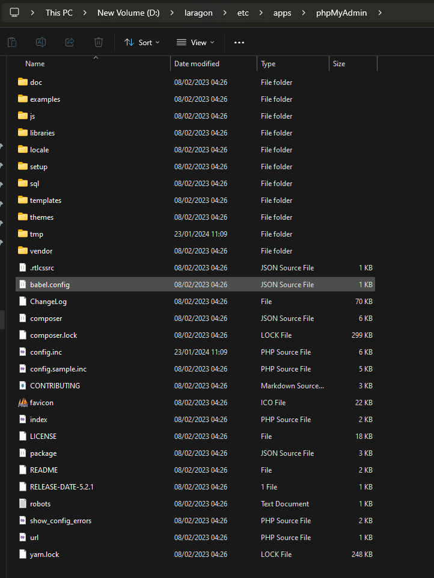

# Config setting apache in windows to deploy reactjs

1. tambahkan basename ini pada router sesuaikan dengan nama nya
   <BrowserRouter basename="/react-app">

2. lalu tambahkan juga base pada vite.config.js seperti ini
   export default defineConfig({
   base: "/react-app", // Subfolder tempat aplikasi Anda dihosting
   plugins: [react()],
   });

3. lalu silahkan build webnya dan pindahkan folder dist ke www

------- config apache -------

1. buka httpd.conf dan aktifkan settingan ini agar config dapat membaca configurasi dari httpd-vhosts.conf
   Include conf/extra/httpd-vhosts.conf

2. lalu tambahkan ini juga pada httpd.conf
   <IfModule mime_module> # # TypesConfig points to the file containing the list of mappings from # filename extension to MIME-type. #
   TypesConfig conf/mime.types

# MIME Types for JavaScript and CSS

AddType application/javascript .js
AddType text/css .css
AddType image/svg+xml .svg
AddType application/json .json
AddType application/wasm .wasm

    #
    # AddType allows you to add to or override the MIME configuration
    # file specified in TypesConfig for specific file types.
    #
    #AddType application/x-gzip .tgz
    #
    # AddEncoding allows you to have certain browsers uncompress
    # information on the fly. Note: Not all browsers support this.
    #
    #AddEncoding x-compress .Z
    #AddEncoding x-gzip .gz .tgz
    #
    # If the AddEncoding directives above are commented-out, then you
    # probably should define those extensions to indicate media types:
    #
    AddType application/x-compress .Z
    AddType application/x-gzip .gz .tgz

    #
    # AddHandler allows you to map certain file extensions to "handlers":
    # actions unrelated to filetype. These can be either built into the server
    # or added with the Action directive (see below)
    #
    # To use CGI scripts outside of ScriptAliased directories:
    # (You will also need to add "ExecCGI" to the "Options" directive.)
    #
    #AddHandler cgi-script .cgi

    # For type maps (negotiated resources):
    #AddHandler type-map var

    #
    # Filters allow you to process content before it is sent to the client.
    #
    # To parse .shtml files for server-side includes (SSI):
    # (You will also need to add "Includes" to the "Options" directive.)
    #
    #AddType text/html .shtml
    #AddOutputFilter INCLUDES .shtml

</IfModule>

3. config pada httpd-vhosts.conf agar dapat membuat routingannya

# Alias untuk phpMyAdmin

Alias /phpmyadmin "D:/laragon/etc/apps/phpmyadmin/"

<Directory "D:/laragon/etc/apps/phpmyadmin/">
Options Indexes FollowSymLinks
AllowOverride All
Require all granted
</Directory>

# Alias untuk proyek React jko

Alias /react-app "D:/laragon/www/react/jko/dist"

<Directory "D:/laragon/www/react/jko/dist">
Options Indexes FollowSymLinks
AllowOverride All
Require all granted
</Directory>

# Alias untuk proyek React hangnadim

Alias /hang-nadim "D:/laragon/www/react/hangnadim/dist"

<Directory "D:/laragon/www/react/hangnadim/dist">
Options Indexes FollowSymLinks
AllowOverride All
Require all granted
</Directory>

# Alias untuk proyek React notepad

Alias /notepad "D:/laragon/www/react/notepad/dist"

<Directory "D:/laragon/www/react/notepad/dist">
Options Indexes FollowSymLinks
AllowOverride All
Require all granted
</Directory>

# Alias untuk proyek React linktree

Alias /linktree "D:/laragon/www/react/linktree/dist"

<Directory "D:/laragon/www/react/linktree/dist">
Options Indexes FollowSymLinks
AllowOverride All
Require all granted
</Directory>

# Alias untuk proyek PBL_DAP

Alias /PBL_DAP "D:/laragon/www/PBL_DAP"

<Directory "D:/laragon/www/PBL_DAP">
Options Indexes FollowSymLinks
AllowOverride All
Require all granted
</Directory>

# Default VirtualHost

<VirtualHost \*:80>
DocumentRoot "D:/laragon/www/"
ServerName localhost # Pastikan ini adalah default
ErrorLog "logs/localhost-error.log"
CustomLog "logs/localhost-access.log" common
</VirtualHost>

4. jika phpmyadmin tidak bisa di akses oleh pc lain silahkan buka phpmyadmin.conf dan masukan settingan ini
   Alias /phpmyadmin "D:/laragon/etc/apps/phpMyAdmin/"

# to give access from outside

# replace the lines

#

# Require local

#

# by

#

# Require all granted

#

<Directory "D:/laragon/etc/apps/phpMyAdmin/">
Options Indexes FollowSymLinks MultiViews
AllowOverride all

    Require all granted

</Directory>

struktur folder phpmyadmin

